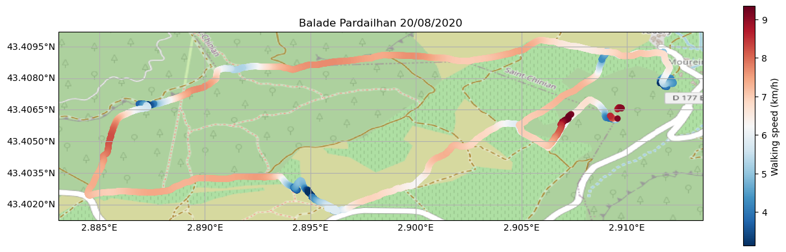

# Maprando

A little script to create personalized maps from my Strava activities.

The script reads Strava activities gpx files and store the results in a pandas dataframe,
computes and filter velocity, and draws the resulting points on a map using cartopy.

### Contribute

Please feel free to contribute by opening issues or pull-requests!
